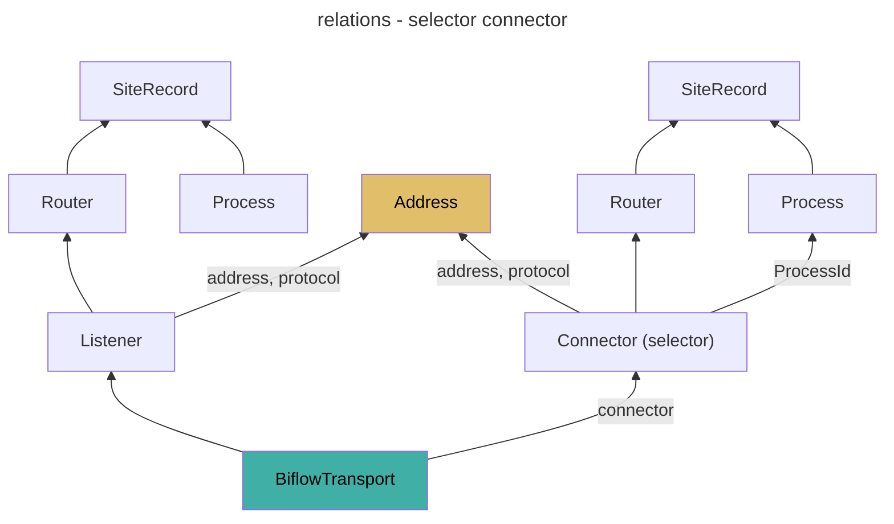

```mermaid
---
title: relations - selector connector
---
flowchart BT;


    classDef inferred fill:#E1BE6A,color:black
    classDef flow fill:#40B0A6,color:black

    sL["SiteRecord"];
    rL["Router"] -->sL;
    Listener --> rL;
    pL["Process"] --> sL;
   
    rk["Address"]:::inferred

    sC["SiteRecord"];
    rC["Router"] -->sC;
    pC["Process"] --> sC;
    connectorS["Connector (selector)"] --> rC;
    connectorS-- ProcessId-->pC;
    
    %% connectorH["Connector (host)"] --> rC;
    %% target["ConnectorTarget"]:::inferred-- process -->pC;
    %% target-- connector -->connectorH;
    
    Listener-- address, protocol-->rk
    connectorS-- address, protocol -->rk
    %% connectorH-- address, protocol -->rk


    bf["BiflowTransport"]:::flow-->Listener
    bf-- connector -->connectorS
    %% bf["BiflowTransport"]-- connector -->connectorH

```
